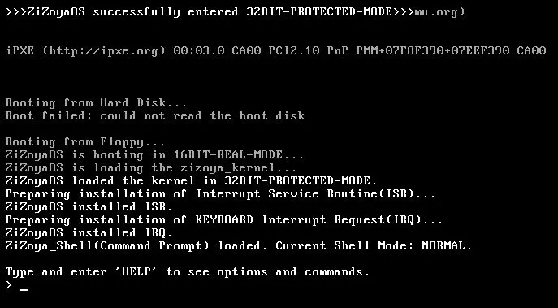

# ZiZoyaOS
A toy operating system from scratch (in progress).
## Demos:
ZiZoyaOS runs on a QEMU virtual machine/(qemu-system-i386) emulator:

ZiZoyaOS runs on a real PC(Old SONY VAIO):

## Environment requirements:
1. nasm - assembler for assembly code
2. qemu - CPU emulator to debug our OS
3. gcc - compiler for C code

## QEMU instruction:
In QEMU Windows version which executable files are separated, EXEs below can be used for testing:
1. qemu-system-i386
2. qemu-system-x86_64

## Important logs:
1. 2020/12/21 It seems MingGW has some differences from Linux one which caused extra obstacles during developing, therefore, I decided to switch my environment to Linux in future developing. Current step: zizoya-kernel. Everything before zizoya-kernel(folder) is totally based on Windows environment.
2. I have abandoned this project long time ago and it is not an fully developed operating system technically. Feel free to continue working on it!
